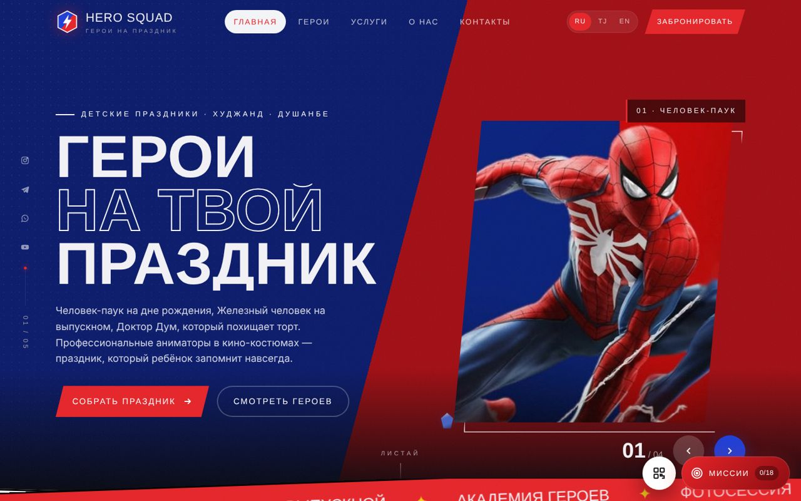

<div align="center">



# Hero Squad

**Многостраничный сайт на трёх языках для (вымышленного) сервиса детских праздников с аниматорами-супергероями. Внутри есть живой многопользовательский квест, охота за пасхалками и админка. Всё написано на чистом HTML, CSS и JavaScript.**

[**Открыть сайт**](https://komyor09.github.io/hero_squad/) · [Админка](https://komyor09.github.io/hero_squad/admin.html) · [Архитектура](docs/ARCHITECTURE.md) · [English README](README.md)

</div>

---

## О проекте

Сайт вымышленной компании из Худжанда и Душанбе: она отправляет на детские дни рождения аниматоров в костюмах героев Marvel. Это курсовой проект по циклу **«Веб-дизайн»** в ХПИ ТТУ им. акад. М.С. Осими. Проект показывался группе вживую.

Задание звучало как «пять страниц, максимально красиво». Сверх этого я поставил себе три цели:

- **Без фреймворков и сборщиков.** HTML, CSS и чистый JS, сайт открывается прямо с диска.
- **Три языка из одного источника.** Python-генератор собирает 18 статических страниц (6 страниц × RU / TJ / EN).
- **Интерактивная презентация.** Однокурсники сканируют QR-код, проходят квест на время со своих телефонов и соревнуются в таблице лидеров. Ведущий управляет квестом из админки.

> Компания, телефоны и цены вымышлены. Имена и изображения персонажей принадлежат Marvel / Disney и используются в некоммерческом учебном проекте. Проект не связан с Marvel и Disney.

## Возможности

- **Сайт.** Страницы «Главная», «Герои», «Услуги», «О нас», «Контакты» и тематическая 404. Есть слайдер, 3D-карточки с характеристиками, фильтр, калькулятор с промокодами и форма заявки с проверкой полей и маской `+992`.
- **Три языка.** Русский, таджикский и английский. Статичный текст генерируется для каждого языка, а текст из скриптов переводится функцией `tr(ru, tj, en)`.
- **16 пасхалок.** 6 камней бесконечности, «щелчок Таноса» на `<canvas>`, терминал J.A.R.V.I.S., «Зрение Старка» (HUD-инспектор HTML), Дэдпул, Дормамму, Ваканда и другие.
- **Помощник для презентации.** 18 миссий с очками опыта и званиями, тур по сайту из 14 шагов с подсветкой элементов, QR-код для проектора и удостоверение в конце.
- **Живой квест и админка.** Старт и стоп раунда для всех телефонов, таймер, таблица лидеров с режимом проектора, объявления, заявки с выгрузкой в CSV, редактирование героев и цен. Работает на **Firebase Realtime Database**, без него — в демо-режиме.
- **Качество.** Адаптивная вёрстка от 360 px, учёт `prefers-reduced-motion`, e2e-тесты Playwright в GitHub Actions.

Скриншоты и подробности — в [английском README](README.md#screenshots).

## Запуск

```bash
python -m http.server 8000      # или просто открыть index.html
```

- **Админка:** `admin.html`. Без Firebase работает демо-режим с паролем `avengers`.
- **Настоящая база для телефонов:** инструкция в [docs/FIREBASE_SETUP.md](docs/FIREBASE_SETUP.md).

### Разработка

```bash
pip install -r requirements-dev.txt && python -m playwright install chromium
python tools/build_pages.py   # пересобрать 18 страниц (HTML не редактировать вручную!)
python tools/make_qr.py       # QR-коды
python tests/e2e.py           # автотесты
```

## Автор

**Комёр** — backend-разработчик (PHP/Laravel, Angular), студент ХПИ ТТУ, Худжанд · [github.com/komyor09](https://github.com/komyor09)

Код распространяется по [лицензии MIT](LICENSE). Изображения персонажей под лицензию не подпадают.
